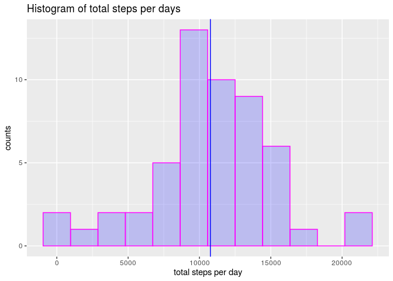
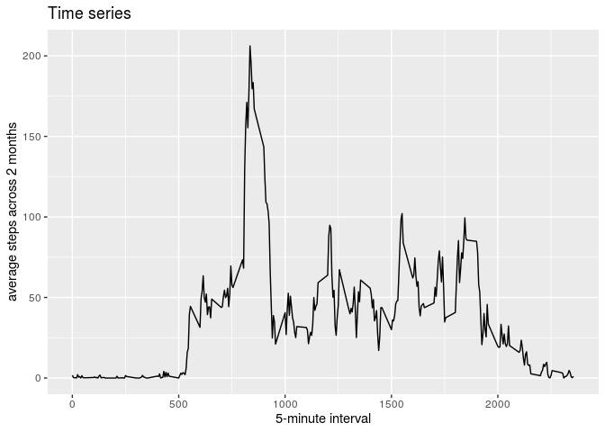
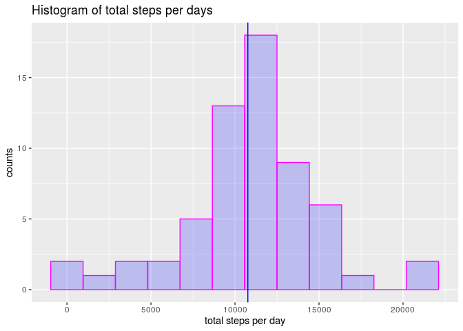
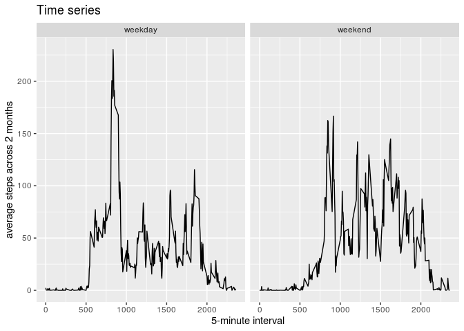

```r
library(knitr)
library(lubridate)
library(dplyr)
library(ggplot2)
opts_chunk$set(echo = TRUE,  message=FALSE, warning=FALSE)
options(scipen=999)
Sys.setlocale("LC_TIME", "en_GB.UTF-8")
```

```
## [1] "en_GB.UTF-8"
```

```r
dir.create('figure')
```


## Loading and preprocessing the data

The step data is loaded to a variable called *data*. 


```r
data <- read.csv("activity.csv")
data$date <- as.Date(data$date)
head(data)
```

```
##   steps       date interval
## 1    NA 2012-10-01        0
## 2    NA 2012-10-01        5
## 3    NA 2012-10-01       10
## 4    NA 2012-10-01       15
## 5    NA 2012-10-01       20
## 6    NA 2012-10-01       25
```

Steps were collected between 2012-10-01 and 2012-11-30, in intervals of 5 minutes. NA indicates missing values.


## What is mean total number of steps taken per day?

In order to answer this question, intervals with NA step count have been removed as first step. The order of the remove may alter the results, so please take this into account when interpreting the results.


```r
step_day <- data %>% filter(!is.na(steps)) %>% group_by(date) %>%  tally(wt = steps)
med <- median(step_day$n)
mu <- round(mean(step_day$n))
ggplot(data=step_day, aes(step_day$n)) + geom_histogram(bins= 12, col='magenta', fill='blue', alpha=.2) + labs(title= 'Histogram of total steps per days', x= 'total steps per day', y='counts') +  geom_vline(xintercept = mu, color= 'blue', size=.5, show.legend = T) 
```

<!-- -->

```r
ggsave(filename = 'figure/Figure1-HistStepsPerDay.png')
```

The number of mean total steps per day is 10766, indicated in the histogram by the horizontal blue line, and the median total steps per day is 10765 (not shown).


## What is the average daily activity pattern?

Again, NA have been removed on the very first step. The time series below show the average of steps given in each 5-minutes during a day, indicatiing which periods of the day the user is more active.
    

```r
step_interval <- data %>% filter(!is.na(steps)) %>% group_by(interval) %>%   summarise_at(vars(steps),funs(mean(., na.rm = T)))
ggplot(data= step_interval, aes(x= interval, y = steps)) + geom_line()  + labs(title= 'Time series ', x= '5-minute interval', y='average steps across 2 months')
```

<!-- -->

```r
ggsave(filename = 'figure/Figure2-AverageDailyPattern.png')
```

The interval with most step (most active) is interval 835.


## Imputing missing values
    
There are 2304 missing values (NA) in the original dataset. To circumvent this problem, we add the average steps of the correspond interval to the days where it is missing.


```r
stepImp <- apply(data, 1, function(x) ifelse(is.na(x[1]), yes = as.numeric(step_interval[step_interval$interval == as.numeric(x[3]), 2]) , no = as.numeric(x[1])) )
dataImp <- data %>% mutate(steps = stepImp)
stepImp_day <- dataImp %>% filter(!is.na(steps)) %>% group_by(date) %>%  tally(wt = steps)
med <-round(median(stepImp_day$n))
mu <- round(mean(stepImp_day$n))
ggplot(data=stepImp_day, aes(stepImp_day$n)) + geom_histogram(bins= 12, col='magenta', fill='blue', alpha=.2) + labs(title= 'Histogram of total steps per days', x= 'total steps per day', y='counts') +  geom_vline(xintercept = mu, color= 'blue', size=.5, show.legend = T) 
```

<!-- -->

```r
ggsave(filename = 'figure/Figure3-HistStepsPerDayImputed.png')
```

Using imputed data, the number of mean total steps per day is 10766, indicated in the histogram by the horizontal blue line, and the median total steps per day is 10766. Note that now, median and mean are the same, i.e. the mean is not biased any more.


## Are there differences in activity patterns between weekdays and weekends?


```r
dataImp <- dataImp %>% mutate(weekday = if_else(weekdays(date) == "Sunday" | weekdays(date) == "Saturday", 'weekend', 'weekday'))
stepImp_interval <- dataImp %>% group_by(interval, weekday) %>%  summarise_at(vars(steps),funs(mean(., na.rm = T)))
ggplot(stepImp_interval, aes(x = interval, y = steps)) + geom_line()  + labs(title= 'Time series ', x= '5-minute interval', y='average steps across 2 months') + facet_grid(. ~ weekday)
```

<!-- -->

```r
ggsave(filename = 'figure/Figure4-WeekdayXWeekend.png')
```

It can be noticed tthat there is a peak of moviment in weekdays between 750-1000 interval which is not seen in the weekends.
